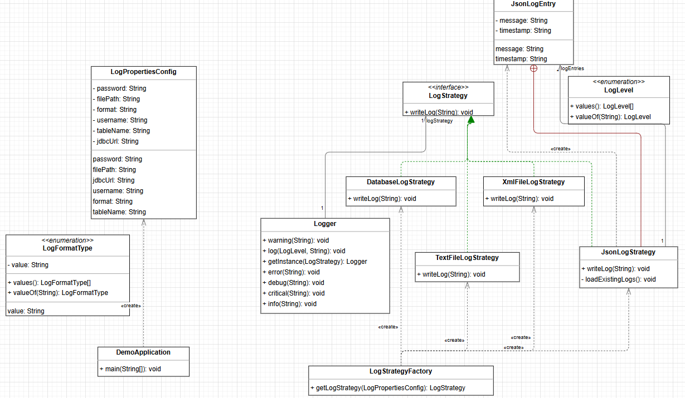

## UML діаграма

Ось UML-діаграма, що ілюструє архітектуру проєкту:

## Основні компоненти

### Конфігураційні класи

- **`LogFormatType`**:
    - Enum, що визначає підтримувані формати логування: `JSON`, `XML`, `TEXT`, `DATABASE`.

- **`LogLevel`**:
    - Enum для визначення рівнів критичності логів: `DEBUG`, `INFO`, `WARNING`, `ERROR`, `CRITICAL`.

- **`LogPropertiesConfig`**:
    - Клас конфігурації для зберігання параметрів логування:
        - Формат логування (`JSON`, `XML`, тощо).
        - Шлях до файлу логів.
        - Налаштування бази даних (JDBC URL, ім’я користувача, пароль, назва таблиці).

- **`LogStrategyFactory`**:
    - Фабрика для створення відповідної стратегії логування на основі вибору користувача.

---

### Класи стратегій

- **`LogStrategy`**:
    - Інтерфейс, який реалізують всі стратегії логування.

- **`JsonLogStrategy`**:
    - Зберігає логи у форматі JSON як масив об’єктів.

- **`XmlFileLogStrategy`**:
    - Записує логи у форматі XML.

- **`TextFileLogStrategy`**:
    - Записує текстові логи у файл, додаючи кожне повідомлення новим рядком.

- **`DatabaseLogStrategy`**:
    - Зберігає повідомлення логів у таблиці бази даних через JDBC.

---

### Логіка програми

- **`DemoApplication`**:
    - Головний клас програми.
    - Дозволяє користувачу вибрати формат логування і налаштувати параметри.

- **`Logger`**:
    - Реалізує шаблон Одинака (Singleton).
    - Забезпечує методи (`info`, `debug`, `error`, тощо) для запису логів з різними рівнями критичності.

---

### Ресурси

- `application.properties`: файл конфігурації для додаткових налаштувань, якщо це необхідно.
- `file.json`, `file.txt`, `file.xml`: приклади ресурсних файлів для тестування.

## Патерни проектування

### Використані патерни:

1. **Стратегія (Strategy Pattern)**:
    - Патерн **Стратегія** дозволяє змінювати спосіб логування без зміни коду класу `Logger`. Клас `LogStrategy` є інтерфейсом, а `JsonLogStrategy`, `TextFileLogStrategy`, `XmlFileLogStrategy` та інші класи є конкретними реалізаціями цього інтерфейсу. У програмі визначається, яка стратегія логування має бути використана залежно від вибору користувача.

2. **Фабрика (Factory Pattern)**:
    - Патерн **Фабрика** застосовується у класі `LogStrategyFactory`, де відповідно до конфігурації (формат, база даних тощо) вибирається відповідний клас стратегії. Це дозволяє централізувати логіку створення об'єктів стратегій логування і зменшує кількість залежностей у коді.

3. **Одиничний екземпляр (Singleton Pattern)**:
    - Патерн **Одиничний екземпляр** використовується у класі `Logger`, де забезпечується, щоб у додатку існував тільки один екземпляр логера для виконання операцій логування.

4. **Шаблонний метод (Template Method Pattern)**:
    - Хоча цей патерн не реалізований напряму, можна побачити в деяких частинах коду (наприклад, в класах стратегій), де базові методи визначають спільний шаблон для логування, а конкретні стратегії змінюють лише частини цього шаблону.

5. **Перелік (Enum Pattern)**:
    - В класах `LogFormatType` та `LogLevel` використовуються **переліки (enum)** для представлення типів форматів логів і рівнів логування, що дозволяє обмежити можливі значення та уникнути помилок у коді.

6. **Конфігурація через об’єкт (Builder-like Configuration)**:
- `LogPropertiesConfig` є гнучким класом для налаштування параметрів логування.
